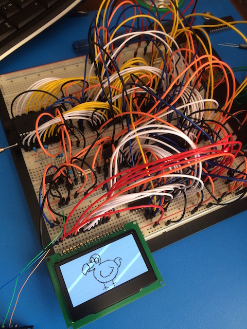

# Dodo: 6502 Portable Game System

 

## Background

Dodo is a 6502 based Portable Game System. This repository houses the system firmware, the hardware design, and a few games. Visit the [Dodo Homepage](http://www.dodolabs.io) for more background and status updates on the project. Detailed logs are posted on [Hackaday](https://hackaday.io/project/9325-dodo-6502-game-system).

## Software

The Dodo software is all built using [cc65](https://github.com/cc65/cc65). The system firmware is written in assembly and exposes an API that is callable from C. Games are intended to be written in C, and the API is exposed through api.h. See the dodo-sample for more information on game development.

## Hardware

The hardware is designed in Diptrace and is undergoing major revisions. See the Dodo Homepage for more updates.

## Other Repositories

- [gododo](https://github.com/peternoyes/gododo): Tool written in Go
	- Simulator, Outputs to either Console or as a Webpage
	- Flashes games to the FRAM cartridge
- [dodo-sample](https://github.com/peternoyes/dodo-sample) - Sample project

