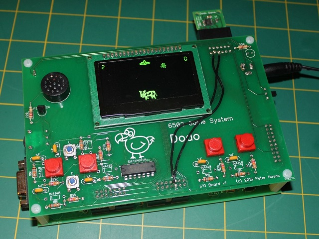

# Dodo

Dodo is homebrew 6502 portable game system. See the main [webpage](http://dodolabs.io) for an overview of the project.

This is the main repository that hosts the hardware design and the sytem firmware (ABI). 

## Related Repositories
- [dodo-playground](https://github.com/peternoyes/dodo-playground) - Hosted IDE and Simulator for Dodo
- [gododo](https://github.com/peternoyes/dodo-playground) - CLI tools for local development
- [dodo-sim](https://github.com/peternoyes/dodo-playground) - Core simulator that powers the playground and CLI

## Links
This project would not be possible without others having documented their 6502 projects online. The following two resources have been invaluable in learning how to build a 6502 computer.
- http://wilsonminesco.com/6502primer/potpourri.html
- http://www.grappendorf.net/projects/6502-home-computer
