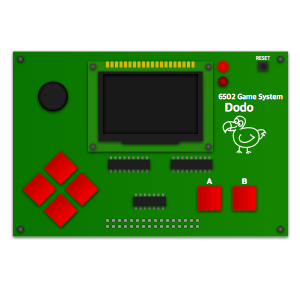

# Dodo

Dodo is a homebrew 6502 portable game system. See the main [webpage](http://dodolabs.io) for an overview of the project.

This is the main repository that hosts the hardware design and the sytem firmware (ABI). 

## Related Repositories
- [dodo-playground](https://github.com/peternoyes/dodo-playground) - Hosted IDE and Simulator for Dodo
- [gododo](https://github.com/peternoyes/gododo) - CLI tools for local development
- [dodo-sim](https://github.com/peternoyes/dodo-sim) - Core simulator that powers the playground and CLI
